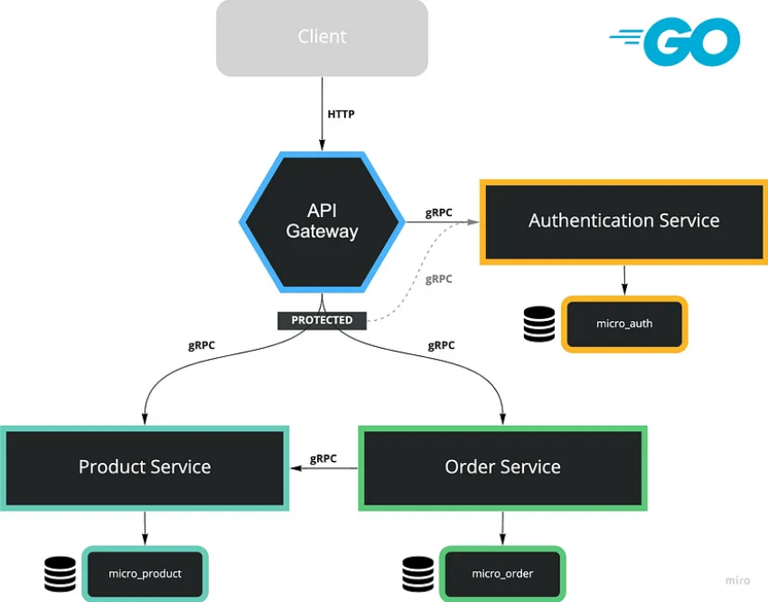

# gomart-resources
This repository contains the docker-compose files, kubernetes manfiests, and helmcharts needed for building and running the **goMart** micorservice application and to automate its deployment (first with a Jenkins CI/CD, then a Jenkins CI pipeline combined with ArgoCD).
Every folder has a `README.md` file that describes more what it contains and how to run everything.

The **goMart** application consists of 3 Microservices and 1 API Gateway which handles incoming HTTP requests. HTTP requests will be forwarded to these Microservices by gRPC.

- [API Gateway](https://github.com/RaniaMidaoui/gomart-gateway): Handles incoming HTTP requests.
- [Authentication Microservice](https://github.com/RaniaMidaoui/gomart-authentication-service): Provides features such as Register, Login and generates Token by JWT.
- [Product Microservice](https://github.com/RaniaMidaoui/gomart-product-service): Provides features such as Add Product, Decrease Stock and Find Product.
- [Order Microservice](https://github.com/RaniaMidaoui/gomart-order-service): The only feature we ship in this Microservice is Create Order.